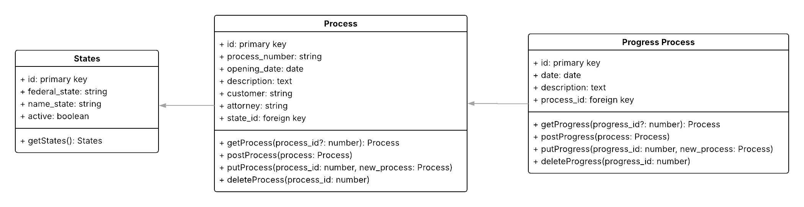
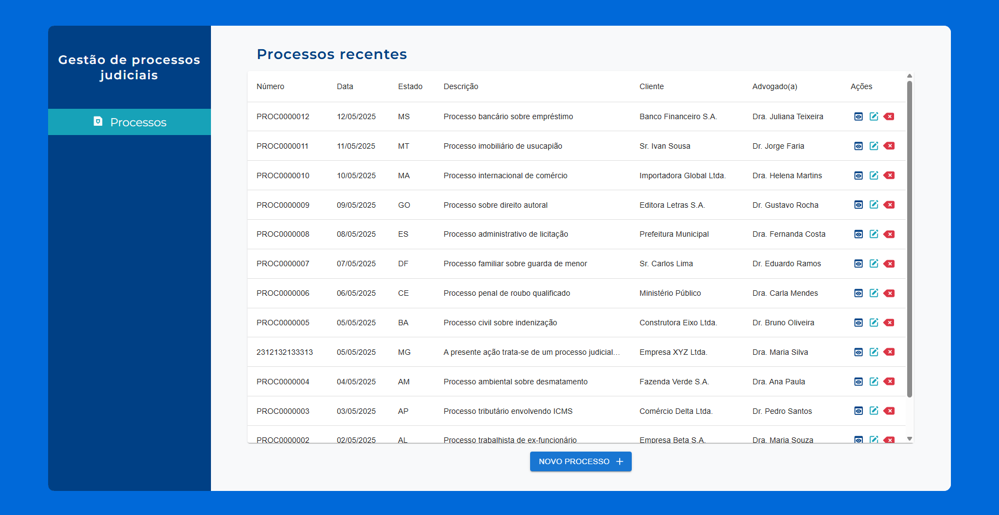

# Boas-vindas ao repositório do projeto cadastro judicial!

O intuito deste projeto é criar uma aplicação **full-stack** para gerenciamento e cadastro de processos judiciais!

Leia o **README** com atenção!.

<details>
  <summary><strong>🚀 Introdução 🚀</strong></summary>
Diagrama de classe e objeto para uma visualização prévia:



Demonstração do design da tela:



</details>
<details>
  <summary><strong>♻ Variáveis de ambiente ♻</strong></summary>

No projeto front-end devem existir dois arquivos, sendo eles:

    - `web/.env.production` / Caso rode o modo de produção
    - `web/.env.development` / Caso rode o modo de desenvolvimento

Contendo a estrutura do arquivo **env.example** na raiz da pasta WEB

No projeto back-end devem existir um arquivo, sendo ele:

    - `api/.env`

Contendo a estrutura do arquivo **env.example** na raiz da pasta API

**Não esqueça de preencher os dados do seu banco de dados (preferencialmente MYSQL)**

*Porta padrão front-end: 3000*
*Porta padrão back-end: 8000*

</details>
<details>
  <summary><strong>⌨️ Rodando localmente (FRONT-END)</strong></summary>

  Versão do node recomendada: **v22.15.0**!

Acesse a pasta web e instale as dependências:

```bash
cd web
(bun/yarn/npm) install
```

Gere o build:

```bash
(bun/yarn/npm) run build
```

Execute o projeto:

```bash
(bun/yarn/npm) run start
OU
(bun/yarn/npm) run dev
```

Ele estará rodando na porta **3000**
<br />

</details>
<details>
  <summary><strong>⌨️ Rodando localmente (BACK-END)</strong></summary>

  Versão do php recomendada: **8.2.12**!

  Versão do Composer recomendada: **2.8.8**!

Acesse a pasta api e instale as dependências:

```bash
cd backend
composer install
```

Com o arquivo .env criado seguindo o env.example gere uma key de segurança:

```bash
php artisan key:generate
```

Popule seu banco de dados (não esqueça de verificar as credenciais na env):

```bash
php artisan migrate --seed
```

Execute o projeto:

```bash
php artisan serve
```

Ele estará rodando na porta **8000**
<br />

</details>
<details>
  <summary><strong>🖥️ Front-end: Dependências e bibliotecas 🖥️</strong></summary>

**Dependências e bibliotecas utilizadas no Front-end**

- `@emotion/react`: **^11.14.0**
- `@emotion/styled`: **^11.14.0**
- `@hookform/resolvers`: **^5.0.1**
- `@mui/icons-material`: **^7.0.2**
- `@mui/material`: **^7.0.2** // Biblioteca principal de componentes UI (Material UI)
- `@tanstack/react-query`: **^5.75.2** // Gerenciamento de estados assíncronos
- `axios`: **^1.9.0** // Requisições HTTP
- `date-fns`: **^4.1.0** // Manipulação de datas
- `next`: **15.3.1**
- `react`: **^19.0.0**
- `react-dom`: **^19.0.0**
- `react-hook-form`: **^7.56.2** // Gerenciamento de formulários
- `react-icons`: **^5.5.0** // Ícones SVG populares
- `zod`: **^3.24.4** // Validação e parsing de dados

<br />
</details>
<details>
  <summary><strong>🛠️ Back-end: Dependências e bibliotecas 🛠️</strong></summary>

**Dependências e bibliotecas utilizadas no Back-end**

- `PHP`: **^8.2.12**
- `Laravel`: **^12.12.0**

<br />
</details>
